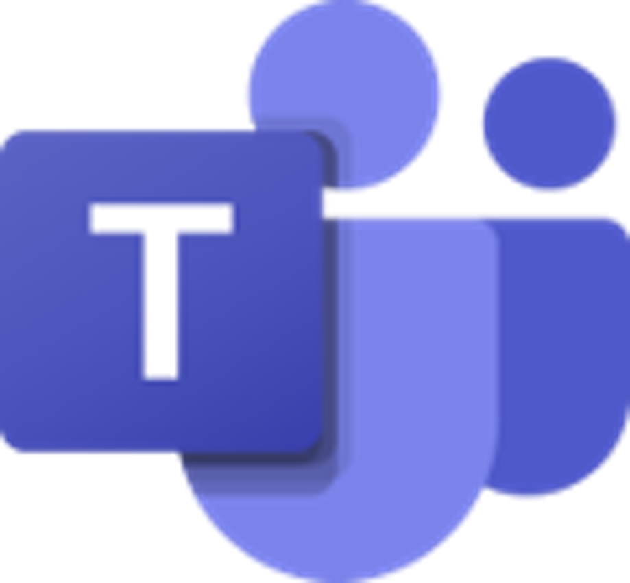

<h1 align="center"> AG Universe </h1>
<p align="center">
  
</p>


---

<p align="center">
  
  
  
</p>


 ---

## 📌 ${\color{blue}Table \ of\ contents}$
- [About the Project](#about)
- [Documentation](#docs)
- [Installation & Setup](#install)
- [Tech Stack](#technologies)
- [Contributors](#team)

---

## 🔍 ${\color{green}Description}$ <a name="about"></a>
Our idea is to create an E-School platform that has multiple exams in the Mathematics, Biology and English fields that you can complete for a grade. It also has a timetable, events, customisable profile and more, that can help you ease up on your school experience!

---

## 📃 ${\color{red}Documentation \ and \  Presentation }$  <a name="docs"></a>
- 📜 [Documentation](https://codingburgas-my.sharepoint.com/:w:/g/personal/dhpapazian23_codingburgas_bg/EcTNIidnRXhEqHABsMUO8BIB0NiLelUMLXQizeLQBf1Qfg?e=9i1p57)
- 🎤 [Presentation](https://codingburgas-my.sharepoint.com/:p:/g/personal/dhpapazian23_codingburgas_bg/ETMPw1Us7qlHjt47fed5NNUBoC1rrFlWbWB5GLTFpnWHaQ?rtime=9B8paMdr3Ug)

---

## 🚀 $${\color{lightblue}Installation \ and \ Setup}$$ <a name="install"></a> 

1️⃣ **Clone our project:**
```sh
 git clone https://github.com/codingburgas/sprint-eschool-ag-universe
```
2️⃣ **Open QT and run it from there.**  🖥️

---

## 💻 $${\color{lightgreen}Tech \ Stack}$$ <a name="technologies"></a>

###  Tools:
<p>
  
  
  
</p>

### Languages:
<p>
       
  
</p>

###  Programs for documentation, communication and design: :
<p>
  
  
  
  
  
</p>

---
 ## 👥 ${\color{green}Team}$ <a name="team"></a>

| Name | Role | Grade |
| :---:   | :---: | :---: |
|  <h3><a href = "https://github.com/KBPozharliev23">Kaloyan Pozharliev</a></h3> | Scrum Trainer | 9G |
| <h3><a href = "https://github.com/GZPavlov23"> Georgi Pavlov </a></h3>| Backend Developer | 9G |
| <h3><a href = "https://github.com/KSTurmanov"> Konstantin Turmanov</a></h3> |  Backend Developer  | 9A |
| <h3><a href = "https://github.com/DHPapazian"> David Papazian</a></h3> | Designer | 9A |

---
