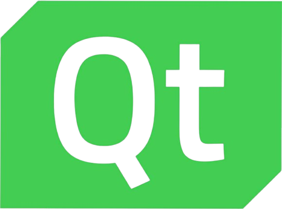

<h1 align="center"> AG Universe <h1>
 

## 📋 Table of contents
  - [Description](#description)
  - [Documentation](#docs)
  - [How to run](#install)
  - [Technologies](#technologies)
  - [Collaborators](#collaborators)
    
<br></br>

## 🔍 Description <a name="description"></a>
<p>Our idea is to create an E-School platform that has multiple exams in the Mathematics, Biology and English fields that you can complete for a grade. It also has a timetable, events, customisable profile and more, that can help you ease up on your school experience! </p>

<br>
 
## 📃 Documentation <a name="docs"></a>
### Documentation
[ Documentation]([https://codingburgas-my.sharepoint.com/:w:/g/personal/gvlitsanowski23_codingburgas_bg/EaLVUubne4VAjRTHSAFY8hMBv5t6rflX-iU20n68C6Dmgg?e=0yIxnR](https://codingburgas-my.sharepoint.com/:w:/g/personal/dhpapazian23_codingburgas_bg/EcTNIidnRXhEqHABsMUO8BIB0NiLelUMLXQizeLQBf1Qfg?e=9i1p57))
### Presentation
[Presentation]([https://codingburgas-my.sharepoint.com/:w:/g/personal/gvlitsanowski23_codingburgas_bg/EaLVUubne4VAjRTHSAFY8hMBv5t6rflX-iU20n68C6Dmgg?e=0yIxnR](https://codingburgas-my.sharepoint.com/:p:/g/personal/dhpapazian23_codingburgas_bg/ETMPw1Us7qlHjt47fed5NNUBoC1rrFlWbWB5GLTFpnWHaQ?rtime=9B8paMdr3Ug))

<br></br>

## 🚀 How to run <a name="install"></a>
*The following instructions are going to show you how to set up the project*

<br></br>

1. Clone the repo:
```
 (https://github.com/codingburgas/sprint-eschool-ag-universe)
```
2. Run with IDE of choice.

<br></br>

## 🖥️ Technologies used <a name="technologies"></a>
 
### IDE & version control system:


<br></br>

### Programming languages & third-party libraries:



<br></br>

### Tools used for documantation, presentation & communication:


<br></br>
<br></br>

## 🧑 Collaborators <a name="collaborators"></a> <br>
- <a href="https://github.com/KBPozharliev23">Kaloyan Pozharliev</a> - Scrum trainer <hr>
- <a href ="https://github.com/KSTurmanov">Konstantin Turmanov</a> - Back-end Developer <br>
- <a href="https://github.com/GZPavlov23">Georgi Pavlov</a> - Back-end Developer <hr>
- <a href="https://github.com/DHPapazian">David Papazyan</a> - Designer <hr>
